# genj - Architecture & Design Document

## Technical Documentation

**Version:** 1.0.0  
**Language:** Java 25  
**Last Updated:** March 2026

---

## Table of Contents

1. [Overview](#overview)
2. [Architecture](#architecture)
3. [Component Design](#component-design)
4. [Data Flow](#data-flow)
5. [Design Decisions](#design-decisions)
6. [JDK 25 Features](#jdk-25-features)
7. [Extension Points](#extension-points)
8. [Dependencies](#dependencies)

---

## Overview

**genj** is a command-line Java project generator that processes templates and creates fully configured project structures. This document describes the internal architecture and design decisions.

### Design Goals

| Goal | Description |
|------|-------------|
| **Simplicity** | Minimal external dependencies, pure JDK where possible |
| **Immutability** | Use records and immutable data structures |
| **Modularity** | Clear separation of concerns between components |
| **Extensibility** | Easy to add new generators or template formats |
| **Portability** | No platform-specific code |

---

## Architecture

### High-Level Architecture

<div align="center">


</div>

### Layered Architecture

The application follows a layered architecture with clear boundaries:

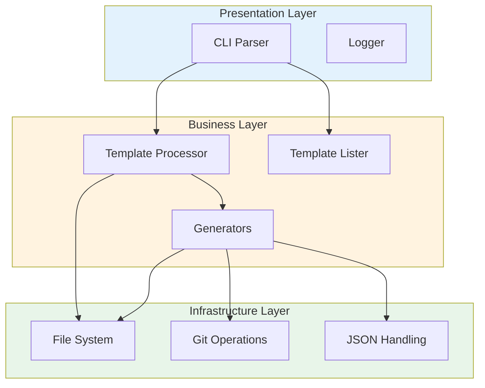

### Package Structure

<div align="center">

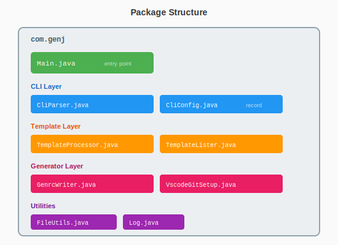

</div>

| Package | Responsibility |
|---------|----------------|
| `com.genj` | All application classes (flat structure) |

| Class | Layer | Purpose |
|-------|-------|---------|
| `Main` | Entry | Application entry point, orchestration |
| `CliParser` | Presentation | Command-line argument parsing |
| `CliConfig` | Domain | Configuration data (record) |
| `TemplateProcessor` | Business | Template extraction and transformation |
| `TemplateLister` | Business | Template discovery and search |
| `GenrcWriter` | Infrastructure | `.genrc` file generation |
| `VscodeGitSetup` | Infrastructure | VSCode and Git initialization |
| `FileUtils` | Infrastructure | File system utilities |
| `Log` | Presentation | Console logging |

---

## Component Design

### Main (Entry Point)

The `Main` class serves as the application entry point and orchestrator.

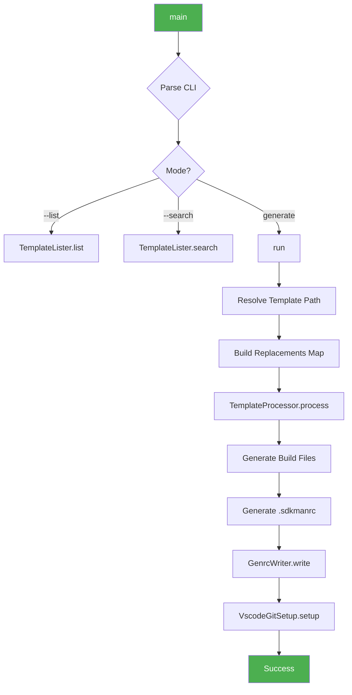

**Responsibilities:**
- Parse CLI arguments
- Route to appropriate handler (list/search/generate)
- Orchestrate generation workflow
- Handle errors

### CliConfig (Record)

<div align="center">

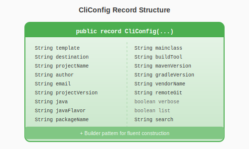

</div>

The `CliConfig` record encapsulates all configuration options:

```java
public record CliConfig(
    String template,
    String destination,
    String projectName,
    // ... other fields
    boolean verbose,
    boolean list,
    String search
) {
    public static Builder builder() { ... }
}
```

**Design Pattern:** Builder Pattern for flexible construction with defaults.

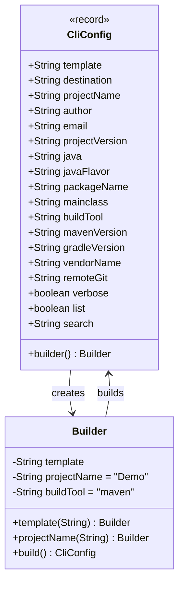

### CliParser

The `CliParser` transforms command-line arguments into a `CliConfig` instance.

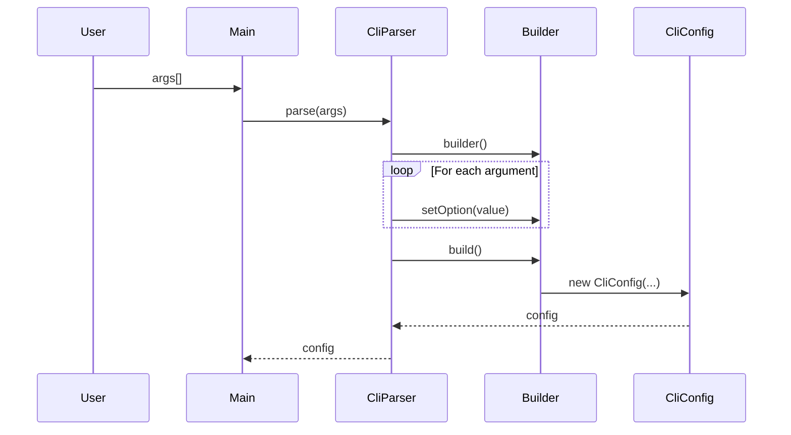

**Features:**
- No external dependencies (pure JDK)
- Switch expressions for argument matching
- Automatic help text generation

### TemplateProcessor

The template processor handles both directory and ZIP file templates.

```mermaid
flowchart TD
    A[processTemplate] --> B{Template Type?}
    
    B -->|Directory| C[copyDirWithReplace]
    B -->|ZIP File| D[extractZipWithReplace]
    
    C --> E[Walk Directory Tree]
    D --> F[Detect Common Prefix]
    F --> G[Iterate ZIP Entries]
    
    E --> H{File Type?}
    G --> H
    
    H -->|Directory| I[Create Directory]
    H -->|Binary| J[Copy As-Is]
    H -->|Text| K[Apply Replacements]
    
    K --> L[Replace Placeholders]
    L --> M[Handle ${PACKAGE}]
    M --> N[Write File]
    
    style A fill:#FF9800,color:white
    style K fill:#E91E63,color:white
    style M fill:#9C27B0,color:white
```

**Key Methods:**

| Method | Purpose |
|--------|---------|
| `processTemplate()` | Entry point, detects template type |
| `copyDirWithReplace()` | Process directory templates |
| `extractZipWithReplace()` | Process ZIP templates |
| `replacePackageInPath()` | Handle `${PACKAGE}` in paths |
| `applyReplacements()` | Replace all placeholders in content |

**Package Placeholder Handling:**

The `${PACKAGE}` placeholder requires special handling:

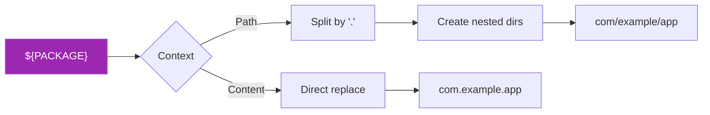

### TemplateLister

Handles template discovery and metadata extraction.

```mermaid
flowchart TD
    A[listAvailableTemplates] --> B[Scan System Path]
    A --> C[Scan User Path]
    
    B --> D[/usr/share/genj/templates]
    C --> E[~/.genj]
    
    D --> F[List Entries]
    E --> F
    
    F --> G{Entry Type?}
    G -->|Directory| H[Read .template file]
    G -->|ZIP| I[Extract .template from ZIP]
    
    H --> J[Parse JSON Metadata]
    I --> J
    
    J --> K[Display Template Info]
```

**Metadata Fields:**

| Field | Type | Description |
|-------|------|-------------|
| `name` | String | Template name |
| `description` | String | Template description |
| `version` | String | Template version |
| `author` | String | Template author |
| `language` | String | Target language |
| `tags` | Array | Searchable tags |
| `license` | String | License type |

### VscodeGitSetup

Configures VSCode workspace and initializes Git repository.

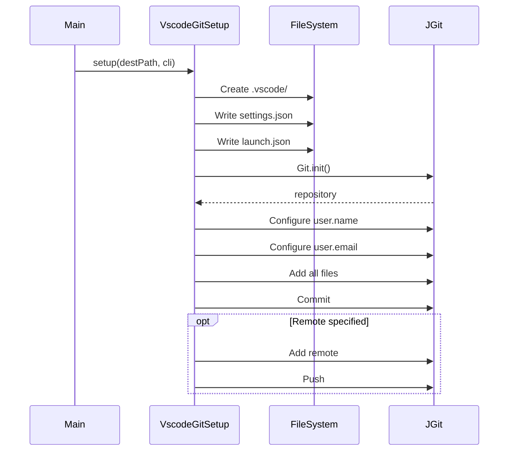

---

## Data Flow

<div align="center">

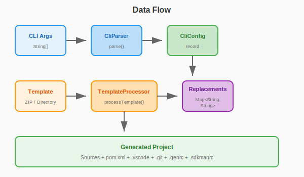

</div>

### Replacement Pipeline

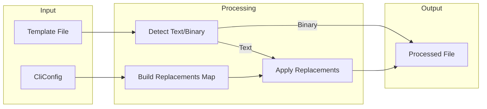

### Placeholder Mapping

| Placeholder | Source | Example |
|-------------|--------|---------|
| `${PROJECT_NAME}` | `cli.projectName()` | `MyProject` |
| `${AUTHOR_NAME}` | `cli.author()` | `John Doe` |
| `${AUTHOR_EMAIL}` | `cli.email()` | `john@example.com` |
| `${PROJECT_VERSION}` | `cli.projectVersion()` | `1.0.0` |
| `${PACKAGE}` | `cli.packageName()` | `com.example` |
| `${JAVA}` | `cli.java()` | `25` |
| `${VENDOR_NAME}` | `cli.vendorName()` | `MyCompany` |
| `${MAINCLASS}` | `cli.mainclass()` | `App` |
| `${PROJECT_YEAR}` | Current year | `2026` |

---

## Design Decisions

### 1. Record for Configuration

**Decision:** Use Java record for `CliConfig`

**Rationale:**
- Immutable by default
- Auto-generated `equals()`, `hashCode()`, `toString()`
- Compact syntax
- Clear intent (data carrier)

### 2. Builder Pattern with Records

**Decision:** Implement Builder as nested class

**Rationale:**
- Records don't support default values in constructors
- Builder provides fluent API
- Maintains immutability of final record

```java
CliConfig config = CliConfig.builder()
    .projectName("MyApp")
    .packageName("com.example")
    .build();
```

### 3. No External CLI Library

**Decision:** Implement CLI parser manually

**Rationale:**
- Reduce dependencies
- Full control over behavior
- JDK 25 switch expressions simplify implementation
- Simple requirements don't justify library overhead

### 4. Text Block for Templates

**Decision:** Use text blocks for generated content

**Rationale:**
- Readable multi-line strings
- No escaping needed
- Format specifiers with `formatted()`

```java
String pom = """
    <project>
      <groupId>%s</groupId>
    </project>
    """.formatted(groupId);
```

### 5. Flat Package Structure

**Decision:** Single `com.genj` package

**Rationale:**
- Small codebase (~9 classes)
- Clear naming conventions
- Avoids over-engineering
- Easy navigation

---

## JDK 25 Features

### Records (JEP 395)

```java
public record CliConfig(
    String template,
    String projectName,
    // ...
) { }
```

### Text Blocks (JEP 378)

```java
String json = """
    {
      "name": "%s",
      "version": "%s"
    }
    """.formatted(name, version);
```

### Pattern Matching in Switch (JEP 441)

```java
switch (arg) {
    case "-t", "--template" -> builder.template(nextArg);
    case "-n", "--project_name" -> builder.projectName(nextArg);
    case "--verbose" -> builder.verbose(true);
    default -> handleUnknown(arg);
}
```

### Stream API Enhancements

```java
List<Path> templates = Files.list(dir)
    .filter(p -> Files.isDirectory(p) || p.toString().endsWith(".zip"))
    .sorted()
    .toList();  // JDK 16+
```

### Sequenced Collections (JEP 431)

```java
String firstPart = resultParts.getFirst();  // JDK 21+
```

---

## Extension Points

### Adding New Placeholders

1. Add field to `CliConfig` record and builder
2. Add CLI option in `CliParser`
3. Add to replacements map in `Main.buildReplacements()`

### Adding New Build Tools

1. Add option value check in `Main.generateBuildFiles()`
2. Create generation logic (e.g., `build.sbt` for SBT)
3. Update `.sdkmanrc` generation

### Adding New Template Formats

1. Extend `TemplateProcessor.processTemplate()` with new type detection
2. Implement extraction/copy logic
3. Reuse `applyReplacements()` for text processing

### Adding New Generators

Create a new class following the pattern:

```java
public final class NewGenerator {
    private NewGenerator() { }
    
    public static void generate(Path destPath, CliConfig cli) 
            throws IOException {
        // Generation logic
    }
}
```

---

## Dependencies

### Runtime Dependencies

| Dependency | Version | Purpose |
|------------|---------|---------|
| JGit | 7.0.0 | Git operations |

### Build Dependencies

| Dependency | Version | Purpose |
|------------|---------|---------|
| Maven Compiler Plugin | 3.13.0 | Java compilation |
| Maven Shade Plugin | 3.6.0 | Fat JAR creation |
| Maven JAR Plugin | 3.4.1 | JAR packaging |

### Dependency Graph

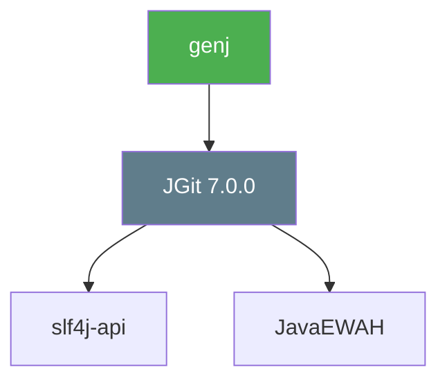

---

## Error Handling

### Strategy

- Fail fast with clear error messages
- Use `IOException` for file operations
- Graceful degradation for non-critical features (Git, remote push)

### Error Categories

| Category | Handling | Exit Code |
|----------|----------|-----------|
| Missing template | Error message, exit | 1 |
| Invalid build tool | Warning, exit | 1 |
| Git failure | Warning, continue | 0 |
| Remote push failure | Warning, continue | 0 |

---

## Testing Strategy

### Unit Testing (Recommended)

| Component | Test Focus |
|-----------|------------|
| `CliParser` | Argument parsing, defaults |
| `CliConfig.Builder` | Builder behavior |
| `FileUtils` | Text detection, file operations |
| `TemplateProcessor` | Placeholder replacement, path handling |

### Integration Testing (Recommended)

| Scenario | Verification |
|----------|--------------|
| Full generation | Output structure, file contents |
| ZIP template | Extraction, replacement |
| Directory template | Copy, replacement |
| Git initialization | Repository state |

---

## Performance Considerations

### Memory Usage

- Templates are processed file-by-file
- No full template caching in memory
- ZIP entries read as streams

### I/O Optimization

- Single pass through template files
- Buffered file operations
- Parent directory creation cached

---

## Security Considerations

| Concern | Mitigation |
|---------|------------|
| Path traversal | Validate template paths |
| Arbitrary file write | Destination directory validation |
| Credential exposure | No credentials in `.genrc` |

---

*Architecture Document - genj v1.0.0*
