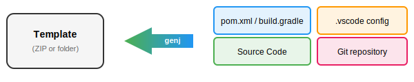
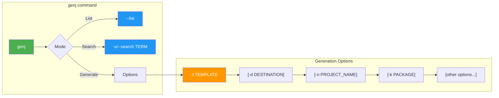
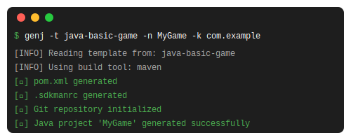
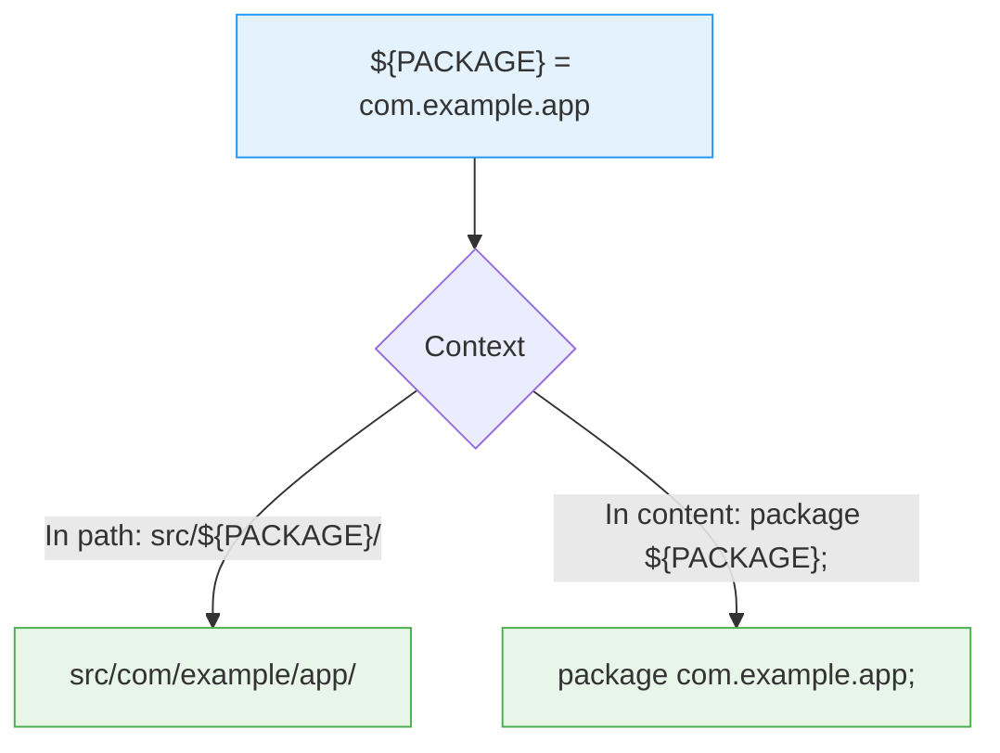
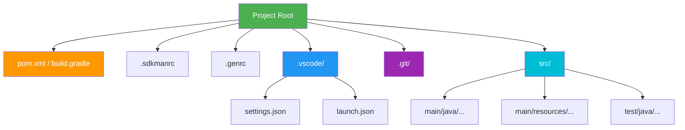
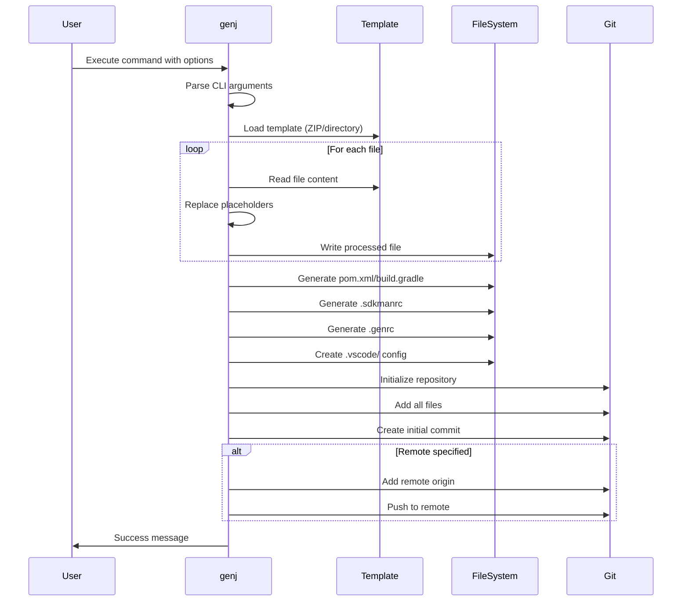
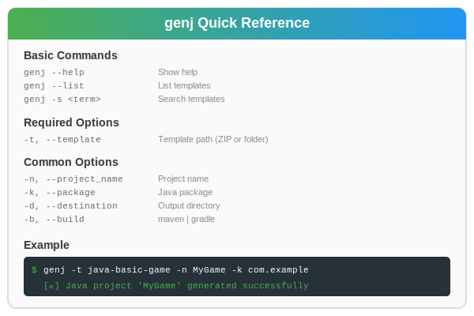

# genj - Java Project Generator

## User Guide

**Version:** 1.0.0  
**Language:** Java 25  
**Build Tool:** Maven

---

## Table of Contents

1. [Introduction](#introduction)
2. [Installation](#installation)
3. [Command Syntax](#command-syntax)
4. [Options Reference](#options-reference)
5. [Usage Examples](#usage-examples)
6. [Templates](#templates)
7. [Generated Files](#generated-files)
8. [Workflow Diagram](#workflow-diagram)

---

## Introduction

**genj** is a command-line tool that generates Java projects from templates. It automates the creation of project structures, replaces placeholders with your configuration values, and sets up build tools, Git repositories, and VSCode configurations.

<div align="center">



</div>

### Key Features

- **Template-based generation**: Use predefined or custom templates
- **Placeholder replacement**: Automatically substitute `${PROJECT_NAME}`, `${PACKAGE}`, etc.
- **Build tool integration**: Generate Maven or Gradle configurations
- **Git initialization**: Create repository with initial commit
- **VSCode setup**: Configure workspace settings and launch configurations
- **SDKMAN support**: Generate `.sdkmanrc` for version management

---

## Installation

### Prerequisites

- **JDK 25** with preview features enabled
- **Maven 3.9+** (for building from source)

### Building from Source

```bash
cd java-version
mvn clean package
```

### Running

```bash
java --enable-preview -jar target/genj-1.0.0.jar [OPTIONS]
```

### Creating an Alias (Optional)

Add to your `~/.bashrc` or `~/.zshrc`:

```bash
alias genj='java --enable-preview -jar /path/to/genj-1.0.0.jar'
```

---

## Command Syntax

### Syntax Diagram



### Basic Syntax

```
genj [MODE] [OPTIONS]
```

**Modes:**
- `--list` - List available templates
- `--search <term>` - Search for templates
- `-t <template>` - Generate a project (default mode)

---

## Options Reference

### Template Options

| Option          | Short | Description                              | Default       |
| --------------- | ----- | ---------------------------------------- | ------------- |
| `--template`    | `-t`  | Path to template (ZIP file or directory) | *Required*    |
| `--destination` | `-d`  | Output directory                         | `.` (current) |

### Project Configuration

| Option              | Short | Description              | Default               |
| ------------------- | ----- | ------------------------ | --------------------- |
| `--project_name`    | `-n`  | Name of the project      | `Demo`                |
| `--author`          | `-a`  | Author name              | `Unknown Author`      |
| `--email`           | `-e`  | Author email address     | `email@unknown.local` |
| `--project_version` | `-v`  | Initial project version  | `0.0.1`               |
| `--vendor_name`     | `-l`  | Vendor/organization name | `Vendor`              |

### Java Configuration

| Option           | Short | Description              | Default    |
| ---------------- | ----- | ------------------------ | ---------- |
| `--java_version` | `-j`  | Target JDK version       | `25`       |
| `--java_flavor`  | `-f`  | SDKMAN Java distribution | `25-zulu`  |
| `--package`      | `-k`  | Java package name        | `com.demo` |
| `--mainclass`    | `-m`  | Main class name          | `App`      |

### Build Tool Configuration

| Option             | Short | Description                      | Default |
| ------------------ | ----- | -------------------------------- | ------- |
| `--build`          | `-b`  | Build tool (`maven` or `gradle`) | `maven` |
| `--maven_version`  | -     | Maven version for SDKMAN         | `3.9.5` |
| `--gradle_version` | -     | Gradle version for SDKMAN        | `8.5`   |

### Git Configuration

| Option                    | Short | Description               | Default |
| ------------------------- | ----- | ------------------------- | ------- |
| `--remote_git_repository` | `-r`  | Remote Git repository URL | *None*  |

### Utility Options

| Option      | Short | Description                       |
| ----------- | ----- | --------------------------------- |
| `--verbose` | -     | Enable detailed output            |
| `--list`    | -     | List available templates          |
| `--search`  | `-s`  | Search templates by name/metadata |
| `--help`    | `-h`  | Display help message              |
| `--version` | -     | Show version information          |

---

## Usage Examples

### Example 1: Basic Project Generation

Generate a simple Java project with default settings:

```bash
genj -t /path/to/template -n MyProject
```

<div align="center">



</div>

### Example 2: Full Configuration

Generate a project with all options specified:

```bash
genj \
  -t ~/templates/java-web-app \
  -d ~/Projects \
  -n WebServer \
  -k com.mycompany.web \
  -a "John Doe" \
  -e "john.doe@example.com" \
  -v "1.0.0" \
  -j 25 \
  -m Server \
  -b maven \
  --verbose
```

### Example 3: Using Gradle Instead of Maven

```bash
genj -t java-basic-game -n MyGame -k com.game -b gradle --gradle_version 8.10
```

### Example 4: With Remote Git Repository

```bash
genj \
  -t java-basic-main \
  -n MyProject \
  -k com.company.project \
  -r git@github.com:username/myproject.git
```

### Example 5: List Available Templates

```bash
genj --list
```

**Output:**
```
=== Available Templates ===

📦 System templates (/usr/share/genj/templates):
  📋 Template: java-basic-game/
     Description: Basic Java game template
     Language: Java
     Tags: game, awt, swing

👤 User templates (~/.genj):
  📋 Template: my-custom-template.zip
     Description: My custom template
```

### Example 6: Search for Templates

```bash
genj --search game
```

---

## Templates

### Template Structure

A template can be a **directory** or a **ZIP file** containing:

```
template/
├── .template              # Optional: JSON metadata
├── src/
│   └── main/
│       ├── java/
│       │   └── ${PACKAGE}/
│       │       └── ${MAINCLASS}.java
│       └── resources/
│           └── config.properties
├── README.md
└── LICENSE
```

### Placeholders

The following placeholders are replaced during generation:

| Placeholder          | Description                             | Example            |
| -------------------- | --------------------------------------- | ------------------ |
| `${PROJECT_NAME}`    | Project name                            | `MyProject`        |
| `${AUTHOR_NAME}`     | Author name                             | `John Doe`         |
| `${AUTHOR_EMAIL}`    | Author email                            | `john@example.com` |
| `${PROJECT_VERSION}` | Version                                 | `1.0.0`            |
| `${PACKAGE}`         | Java package (also creates directories) | `com.example`      |
| `${JAVA}`            | Java version                            | `25`               |
| `${VENDOR_NAME}`     | Vendor name                             | `MyCompany`        |
| `${MAINCLASS}`       | Main class name                         | `App`              |
| `${PROJECT_YEAR}`    | Current year                            | `2026`             |

### Package Placeholder Behavior

The `${PACKAGE}` placeholder has special behavior:
- In **file paths**: Creates nested directories (`com/example/app`)
- In **file content**: Replaced as-is (`com.example.app`)



### Template Metadata (.template)

Create a `.template` file in JSON format:

```json
{
  "name": "Java Game Template",
  "description": "A basic Java game with AWT/Swing",
  "version": "1.0.0",
  "author": "Your Name",
  "language": "Java",
  "tags": ["game", "awt", "swing"],
  "license": "MIT",
  "created_at": "2026-01-01"
}
```

---

## Generated Files

### Project Structure

After running genj, the following structure is created:



### File Descriptions

| File                       | Description                      |
| -------------------------- | -------------------------------- |
| `pom.xml` / `build.gradle` | Build configuration              |
| `.sdkmanrc`                | SDKMAN environment configuration |
| `.genrc`                   | Generation metadata (JSON)       |
| `.vscode/settings.json`    | VSCode project settings          |
| `.vscode/launch.json`      | VSCode debug configuration       |
| `.git/`                    | Initialized Git repository       |

### Sample .genrc Content

```json
{
  "project_name": "MyProject",
  "author": "John Doe",
  "email": "john@example.com",
  "project_version": "1.0.0",
  "package": "com.example",
  "mainclass": "App",
  "java_version": "25",
  "build_tool": "maven",
  "created_at": "2026-03-09T10:00:00Z",
  "generated_with": {
    "cmd": "genj",
    "version": "1.0.0"
  }
}
```

---

## Workflow Diagram



---

## Troubleshooting

### Common Issues

| Issue                       | Solution                       |
| --------------------------- | ------------------------------ |
| `Template not found`        | Check the template path exists |
| `Unsupported build tool`    | Use `maven` or `gradle` only   |
| `Git initialization failed` | Ensure Git is installed        |
| `Preview features required` | Add `--enable-preview` flag    |

### Verbose Mode

Enable verbose mode for detailed debugging:

```bash
genj -t mytemplate -n MyProject --verbose
```

---

## Quick Reference Card

<div align="center">



</div>

---

## License

This project is licensed under the MIT License.

---

*Generated with genj v1.0.0*
